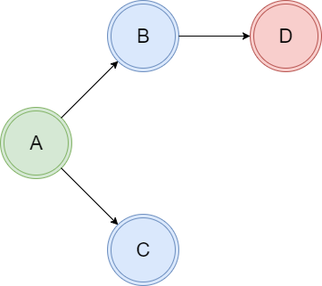

<!--
class:

    - invert

_backgroundImage: url(./assets/theme/media/image1.jpeg)
-->

# <!--fit--> Cake build automation → Введение

## v0.0.1

<!-- markdownlint-disable MD033 -->
<br /><br /><br /><br /><br /><br /><br />
<!-- markdownlint-enable MD033 -->


<!-- markdownlint-disable MD033 -->
<style scoped>
h1 {

    color: #FC9524;

}
h2 {

    text-align: left;
    color: #B2B2B2;

}
p {
  text-align: left;
}
</style>
<!-- markdownlint-enable MD033 -->

---
<!--
backgroundColor: #FAFAFA
footer: Cake build automation → Введение
paginate: true
class:

    - lead

-->

## Тезисы, часть 1

* Обзор
  * Что такое Cake
  * Основа устройства
  * Обзор документации
    * Введение
    * Запуск сборок
    * Интеграции
      * Редакторы
      * Системы сборки
    * Frosting (поверхностно)

---

## Тезисы, часть 2

* Пишем сборки в Visual Studio Code (LIVE)
  * Hello World
  * Применяем Bootstrappers
  * Собираем Java + Docker (Custom с нуля)
  * Разбираем Сборку UP2

---
<!-- markdownlint-disable MD033 -->
<style scoped>
p {
  text-align: left;
}
</style>
<!-- markdownlint-enable MD033 -->

## Что такое Cake

**Cake — это кроссплатформенная система сборки, использующая DSL с синтаксисом C#**

Прародителем технологии является **Make** - утилита, автоматизирующая процесс преобразования файлов из одной формы в другую. Чаще всего это компиляция исходного кода в объектные файлы и последующая компоновка в исполняемые файлы или библиотеки.

* 1976г. → make
* 2000г. → cmake (C/C++ проекты, etc )
* 2007г. → gradle (java проекты, etc )
* **2014г. → cake (c#/dotnet, etc)**

А еще Rake (Ruby), Fake (F#) и прочие

---

## Место Cake в сравнении с другими технологиями сборки

### Cake vs MSBUILD (NAnt, etc)

* Cake пишется на C#, а не на XML - лучше читаемость
* У Cake лучше возможности отладки
* Cake не замена MSBUILD и других средств сборки

### Cake vs Azure Pipelines  (Jenkins и прочие pipelines-as-a-code)

* В Cake нет связки Сервер → Агент
* У Cake лучше возможности отладки
* Меньше "отладочных" коммитов в репозитории

#### Cake позволяет создать pipeline воспроизводимый на разных средах, снимает зависимость от вендора системы сборки, но не решает проблему зависимости от компиляторов и прочих утилит

---

## Основа устройства Cake

#### Сake использует модель программирования называемую dependency based programming: Для исполнения нашей программы мы определяем задачи и зависимости между ними



---
## Task в Cake

```csharp
Task("A") // Название
.IsDependentOn("B")
.Does(() =>
{
    //Реализация Task A
});

Task("B") // Название
.IsDependentOn("C")
.WithCriteria(DateTime.Now.Second % 2 == 0)
.Does(() =>
{
    //Реализация Task B
});
```
---

## Обзор документации: что читать
* http://cakebuild.net/docs/ - вся актуальная документация
* https://habr.com/ru/post/329194/ - введение для чтения на русском языке (2017г.)

---

## Обзор официальной документации

* Введение
* Запуск сборок и конфигурирование
* Написание сборок
* Интеграции
  * Редакторы
  * Системы сборки
* Frosting (поверхностно)
* Возможности расширения
* **Справка по встроенным функциям**

---

## Live: Пишем код

* Hello World
* Применяем Bootstrappers
* Собираем Java + Docker (Custom почти с нуля)
* Разбираем Сборку UP2 (живой пример, было и стало)

---

## <!--fit--> Спасибо за внимание!
